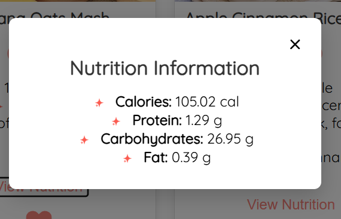
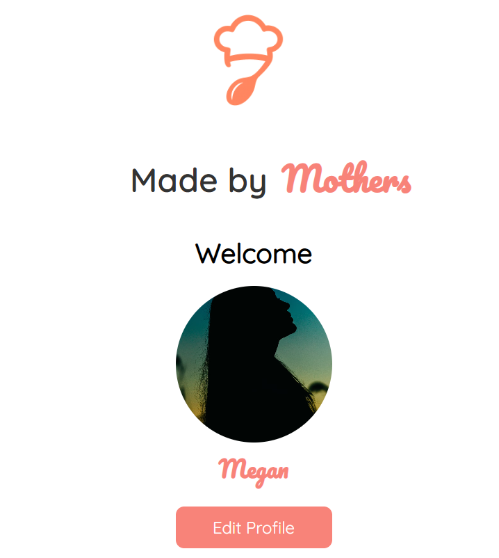

# 👩‍👩‍👧 Made by Mothers – Baby Food Recipe App

Made by Mothers is a frontend React application designed to help parents explore homemade baby food recipes with clear nutrition information and a simple, family-friendly user experience.

The app highlights the benefits of preparing nutritious meals at home and demonstrates frontend skills including API integration, authentication flows, and responsive UI design.

## 🚀 Tech Stack

- React

- React Router

- CSS / Styled Components (based on Figma designs)

- Nutritionix API (nutrition data)

- MockData (for development and testing)

- JWT authentication (token-based login)

## ✨ Key Features

- 👶 8 homemade baby food recipes

- 📊 Nutrition facts fetched from the Nutritionix API

- ❤️ Add / remove favorite recipes (persisted via localStorage)

- 👤 User authentication (Register / Login)

- 📝 Editable user profile (name, email, photo upload option)

- 📱 Fully responsive design (desktop & mobile)

## UI Highlights

### Nutrition Modal


#### Profile Page


## 🧑‍💻 Getting Started (Local Development)

### Follow these steps to run the project locally.

1. Clone the repository
```bash
git clone https://github.com/Megans-Tech-Life/Made_by_Mothers-frontend.git
cd Made_by_Mothers-frontend
```

2️. Install dependencies
```bash
npm install
```

3️. Environment Variables

**Create a .env file in the project root and add your Nutritionix credentials:**

- REACT_APP_NUTRITIONIX_APP_ID=your_app_id
- REACT_APP_NUTRITIONIX_API_KEY=your_api_key


⚠️ Nutritionix requires both an App ID and API Key to be sent in request headers.

4️. Start the development server
```bash
npm start
```

**The app will be available at:**

http://localhost:3001

🌐 Deployment

This project is deployed using GitHub Pages.

Repository
https://github.com/Megans-Tech-Life/Made_by_Mothers-frontend

If redeploying:
```bash
npm run build
npm run deploy
```

*Ensure the homepage field is correctly set in package.json before deploying.*

## 🧩 Challenges & What I Learned

One of the biggest challenges was integrating the Nutritionix API.
Initial requests consistently returned 401 Unauthorized errors despite having valid credentials.

After carefully reviewing the documentation and testing requests incrementally, I discovered that Nutritionix requires specific request headers containing both an App ID and API Key. Once those headers were included correctly, the integration worked as expected.

This experience reinforced the importance of:

- closely reading API documentation
- validating request structure
- debugging methodically instead of guessing

